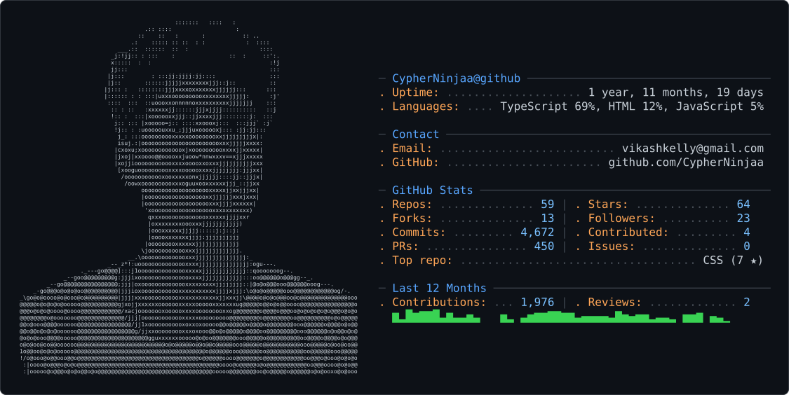

<!-- Header Banner -->
<div align="center">
<picture>
  <source media="(prefers-color-scheme: dark)" srcset="dark_mode.svg" />
  <source media="(prefers-color-scheme: light)" srcset="light_mode.svg" />
  
</picture>
</div>

<!-- Typing SVG -->
<div align="center">
  
</div>

<br/>

<!-- Visitor badge -->
<div align="center">
  
  
</div>

---

## `whoami`

```ts
const vikashin = {
  name     : "Vikashin",
  alias    : "CypherNinjaa",
  role     : "Full Stack Developer",
  location : "India 🇮🇳",
  focus    : ["Web Apps", "UI/UX", "Clean Architecture"],
  building : "Tools for deep thinkers & bold creators",
  mantra   : "Ship with intention. Design with soul.",
};
```

---

## `tech.stack()`

<div align="center">

**Languages**


**Frontend**


**Backend & DevOps**


**Tools**


</div>

---

## `git.stats()`

<div align="center">
  <!--  -->
  <!--  -->
</div>

<div align="center">
  
</div>

---

## `trophies.unlock()`

<div align="center">
  
</div>

---

## `activity.log()`

<div align="center">
  
</div>

---

## `reach.out()`

<div align="center">

[](https://twitter.com/vikashintech)
[](https://linkedin.com/vikashintech)
[](https://github.com/CypherNinjaa)
[](mailto:vikashkelly@gmail.com)

</div>

---

<div align="center">
  
  <sub><i>"Where dreams rise through the silence."</i></sub>
</div>
